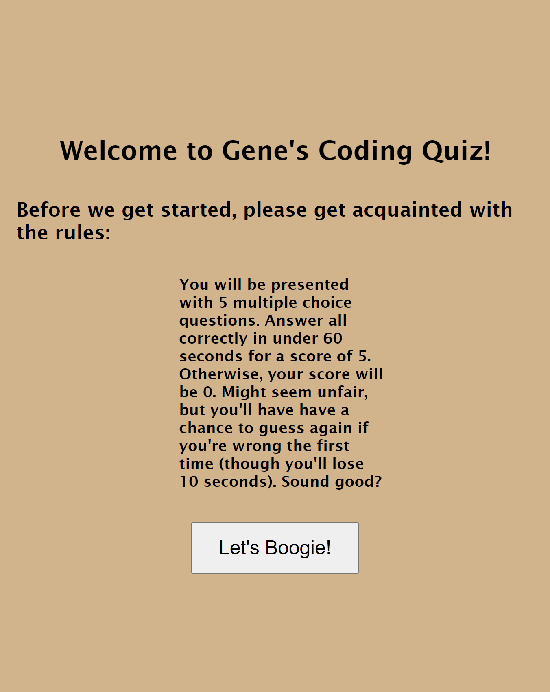
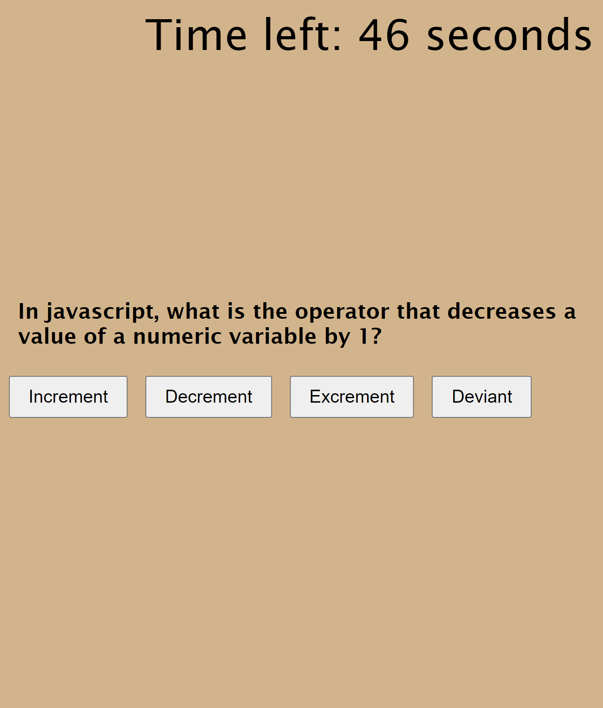

# Challenge 4

## Timed Coding Quiz

This was the most challenging code I have ever written so far, and several times I just scrapped 75-90% of what I had and started over.

The idea here is that a user comes to my page and clicks "Let's Boogie" after reading some quiz rules.  Then a timer appears and one-by-one, question about coding come up and the user attempts to answer them.  Upon giving a correct answer, you're allowed to continue.  Upon giving a correct answer, the timer removes an extra 10 seconds and you have to try again.

I designed it so that the scoring is either you answer all questions correctly within the alotted time (score of 5), or you don't (score of 0) because that's how I feel about certain coding concepts -- either I totally get them right away, or I totally don't.  In fact, the last question of the quiz is designed to see if the user notices what did NOT work well on that page.

I hope you enjoy the quiz that I worked on making, imperfect as it may be, but does mostly satisfy the acceptance criteria.

## Screenshots

## Links

https://github.com/GSuhir/timed-quiz-game

https://gsuhir.github.io/timed-quiz-game/

